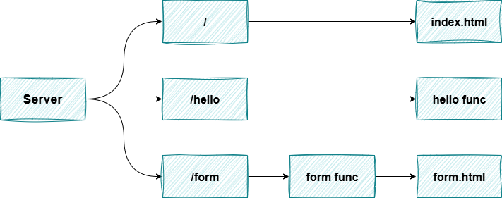

# Go Server

Saya membuat sebuah web server sederhana dengan Go yang menyediakan layanan file statis dan penanganan form. Hehee.

## Arsitektur Server



---

### Form Handler

```go

func formHandler(w http.ResponseWriter, r *http.Request) {
	if err := r.ParseForm(); err != nil {
		fmt.Fprintf(w, "ParseForm() err: %v", err)
		return
	}

	fmt.Fprint(w, "Post request successful\n")
	name := r.FormValue("name")
	address := r.FormValue("address")
	fmt.Fprintf(w, "Name = %s\n", name)
	fmt.Fprintf(w, "Address = %s\n", address)
}
```

### Hello Handler

```go
func helloHandler(w http.ResponseWriter, r *http.Request) {
	if r.URL.Path != "/hello" {
		http.Error(w, "404 not found", http.StatusNotFound)
		return
	}
	if r.Method != "GET" {
		http.Error(w, "method is not supported", http.StatusNotFound)
		return
	}

	fmt.Fprintln(w, "hello!")
}
```

---

<a href="https://github.com/fdhliakbar/">

</a>